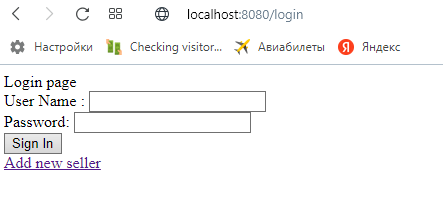
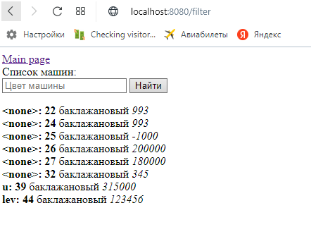

# Car shop
This project is my first written in java spring boot. \
Authorization and user registration are implemented here. \
Everyone can view the list of cars for sale. \
Also, each user is a seller and can put cars up for sale himself. \
 \
All information is saved and restored using the postgres database using spring-jpa. \
The car can be found by its color using the search engine on the main page. \
 \
Car format: \
seller: id color price

Run: docker-compose up \
docker-port: 3000 \
app-port: 8080